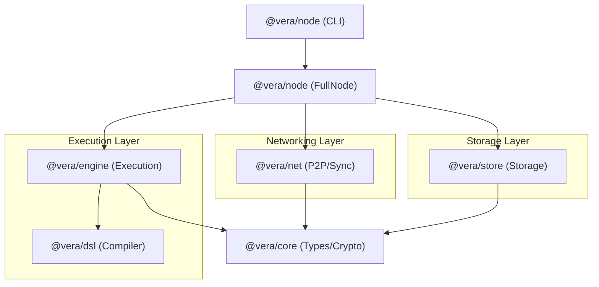

# VERA Architecture Overview

VERA (Verifiable Execution & Registry Architecture) follows a modular, decoupled architecture where execution is separated from consensus/ordering.

## Component Map

### 1. @vera/core (The Foundation)

- **Types**: Shared data structures (Blocks, Transactions, StateRoots).
- **Crypto**: Ed25519 signatures, batch verification (1.1).
- **Encoding**: CBOR-based binary format.
- **Merkle**: Sparse Merkle Trie (SMT) for state commitment (1.2).

### 2. @vera/engine (Execution Layer)

- **Transaction State Processor (TSP)**: Deterministic state transition function.
- **VM**: Register-based VM for executing VERA programs.
- **Parallel Executor**: Optimistic parallel execution with Read-After-Write (RAW) conflict detection (4.1/4.2).
- **Worker Pool**: Isolated `node:worker_threads` for multi-core transaction processing (4.4).
- **Access Lists**: Optimistic state pre-fetching (C.1).

### 3. @vera/net (Networking Layer)

- **P2P Transport**: Node.js `net` based peer-to-peer communication (5.2).
- **Binary Protocol**: Compact Tuple-based CBOR messaging (C.3).
- **Chain Sync**: Headers-First synchronization strategy (C.3).
- **Erasure Coding**: Reed-Solomon based block chunk propagation for bandwidth optimization (C.2).

### 4. @vera/store (Storage Layer)

- **AppendOnlyStore**: "Firewood"-style storage with Versioned State (2.1).
- **CommitLog**: Append-only binary log for blocks and state roots (2.2).
- **WAL**: Write-Ahead Log for crash consistency.
- **Hot/Cold Separation**: LRU caching for active state (B.3).

### 5. @vera/node (Integration)

- **FullNode**: Orchestrates all components.
- **CLI**: Unified entry point (`vera run`, `vera status`).
- **Configuration**: TOML-based configuration system.

## Block Lifecycle

1. **Reception**:
   - A block is received via `@vera/net`.
   - If large, it may be reconstructed from Dispersed chunks (Erasure Coding).
2. **Verification**:
   - Signatures are batch-verified via `@vera/core`.
   - Headers validated (PoW/PoS/Authority).
3. **Execution**:
   - Transactions are scheduled by `@vera/engine`'s Parallel Executor.
   - Workers execute optimistically; scheduler resolves conflicts.
4. **State Update**:
   - State deltas applied to `@vera/store` (AppendOnlyStore).
   - Commit log is appended with new State Root.
5. **Gossip**: Block (or chunks) relayed to other peers.

## Current Maturity

| Component | Status | Note |
| :-------- | :----- | :--- |
| `legacy/` | 🗑️ Cruft | Archived legacy code. |
| `packages/ordering` | ✅ Stable | Ordering/Sequencing logic. |
| `packages/dsl` | ✅ Stable | Core language/compiler. |
| `packages/engine` | 🚀 Beta | Parallel execution active. |
| `packages/net` | 🚀 Beta | Binary Proto + EC active. |
| `packages/store` | 🚀 Beta | WAL + VSS active. |
