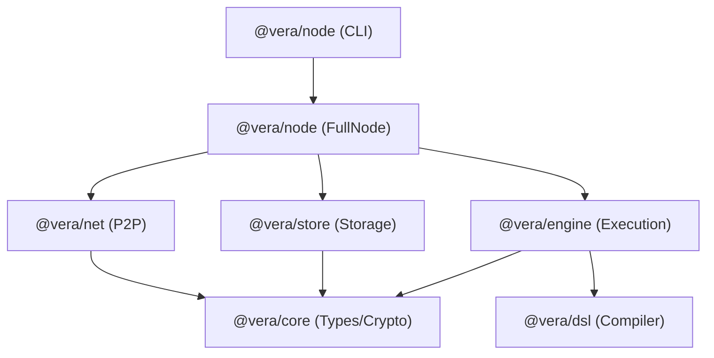

# VERA Architecture Overview

VERA (Verifiable Execution & Registry Architecture) follows a modular, decoupled architecture where execution is separated from consensus/ordering.

## Component Map

### 1. @vera/core (The Foundation)

- **Types**: Shared data structures (Blocks, Transactions, StateRoots).
- **Crypto**: Ed25519 signatures, batch verification.
- **Encoding**: CBOR-based binary format.
- **Merkle**: Sparse Merkle Trie (SMT) for state commitment.

### 2. @vera/engine (Execution Layer)

- **Transaction State Processor (TSP)**: Deterministic state transition function.
- **VM**: Register-based VM for executing VERA programs.
- **Parallel Executor**: Optimistic parallel execution with Read-After-Write (RAW) conflict detection.
- **Worker Pool**: Multi-core scalability for transaction processing.

### 3. @vera/net (Networking Layer)

- **P2P Transport**: Node.js `net` based peer-to-peer communication.
- **Binary Protocol**: Compact CBOR messaging.
- **Sync Manager**: Block synchronization and peer discovery.

### 4. @vera/store (Storage Layer)

- **CommitLog**: Append-only binary log for blocks and state changes.
- **WAL**: Write-Ahead Log for crash-safe state updates.
- **AppendOnlyStore**: Optimized foundation for high-performance state storage.

### 5. @vera/node (Integration)

- **FullNode**: Orchestrates all components.
- **CLI**: Entry point for running and managing the node.
- **Tools**: Includes `compile`, `repl`, and `verify` commands integrated into a single binary.

## Block Lifecycle

1. **Reception**: A block is received via `@vera/net` (Sync or Gossip).
2. **Verification**:
   - Signatures are batch-verified via `@vera/core`.
   - Block structure and parent hash validated.
3. **Execution**:
   - Transactions are fed into `@vera/engine`'s Parallel Executor.
   - Conflicts are detected; serial fallback is used for dependent txs.
4. **State Update**:
   - Final state changes are applied to `@vera/store`.
   - Commit log is appended.
5. **Gossip**: Block is relayed to other peers.

## Current Maturity & "Cruft"

| Component | Status | Note |
| :-------- | :----- | :--- |
| `legacy/` | 🗑️ Cruft | Archived legacy code (old CLI/SDK). |
| `packages/ordering` | ✅ Stable | Ordering and sequencing of transactions. |
| `packages/dsl` | ✅ Stable | Core of the programmability. |
