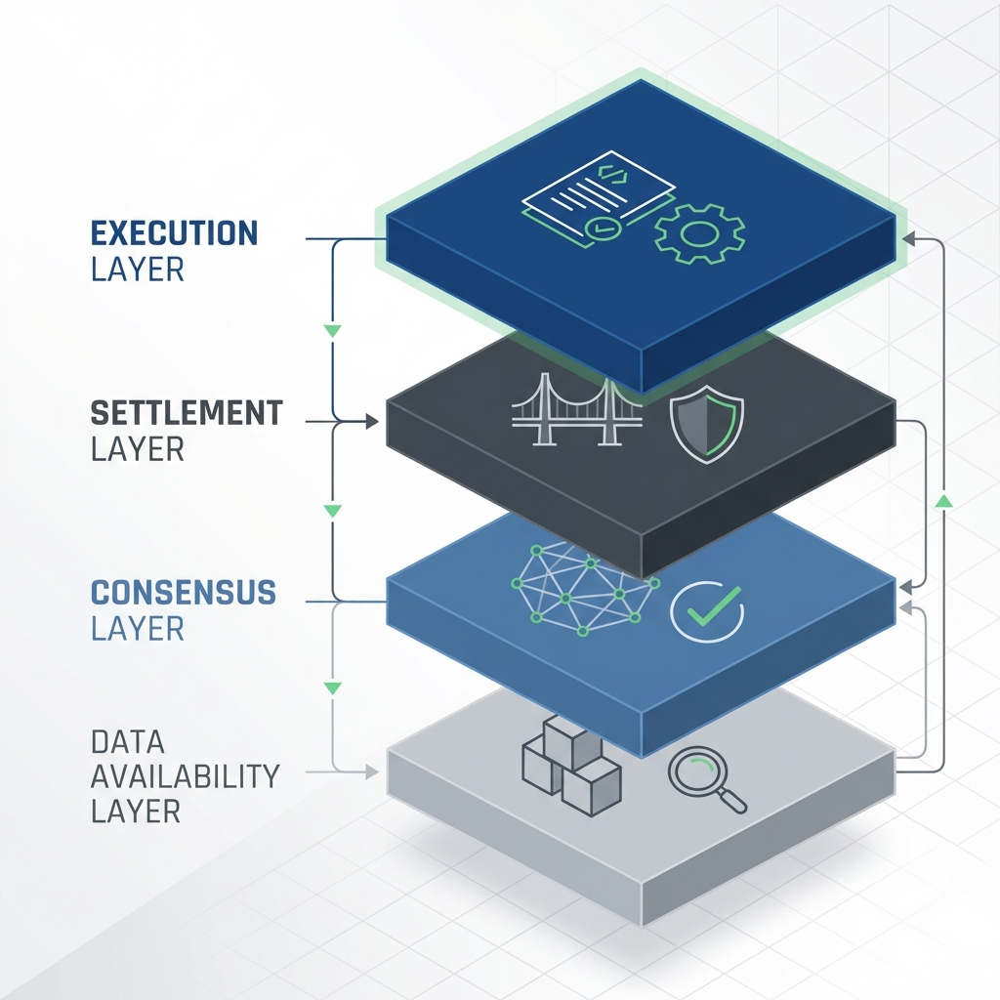
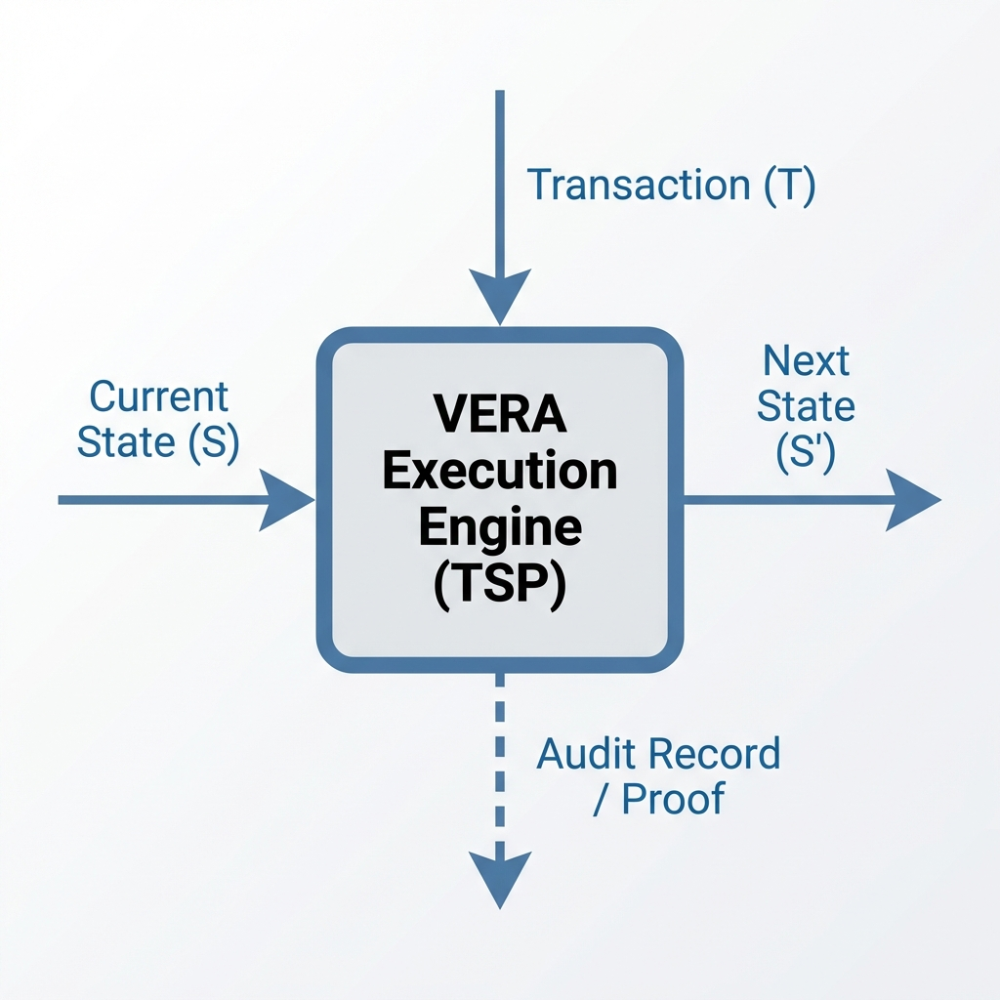

# VERA: Verifiable Execution & Registry Architecture

## Abstract

VERA (Verifiable Execution & Registry Architecture) is an open, general-purpose standard for building shared digital state registries with strong guarantees of verifiability, determinism, and auditability. It defines a modular execution environment where state transitions are transparently and cryptographically verifiable, enabling multiple parties to trust a common source of truth without reliance on cryptocurrency tokens or ad-hoc blockchain jargon. In this whitepaper, we present VERA’s execution semantics – based on a Transaction State Processor (TSP) model – in a manner accessible to both policymakers and engineers, separating execution logic from ordering and data availability concerns for clarity and flexibility. We illustrate how VERA’s design emphasizes first-class properties like predictable outcomes and comprehensive audit trails, using a short domain-specific language (DSL) example to show deterministic, auditable state transitions. Governance is addressed through an open, specification-first approach (eschewing control by any single foundation), and we outline deployment models ranging from permissioned institutional ledgers to rollup-based and public network configurations. Finally, we distinguish VERA from cryptocurrency or smart contract platforms and discuss future directions, including integration of zero-knowledge proofs, formal verification of logic, and federation of registries. VERA is proposed as a technically sound, institutionally-aligned execution standard for trustworthy shared ledgers and registries, aligning with emerging regulatory standards for electronic ledgers in the EU.

## Introduction

Digital governance and services increasingly rely on shared data sources – from business registries and land titles to supply chain logs – that must be trusted by multiple independent parties. Traditional centralized databases, while efficient, require stakeholders to fully trust the controlling entity and make independent audit cumbersome. On the other hand, decentralized ledger technologies (blockchains) promise tamper-evident, shared state; however, their public implementations often come entangled with cryptocurrencies, complex jargon, and governance models that may not align with institutional requirements. EU policymakers and standards bodies have recognized the need for verifiable data registries that provide strong assurances of integrity, authenticity, and chronological ordering of records. For example, the draft EU eIDAS 2.0 regulation introduces Qualified Electronic Ledgers (QEL), defined as ledger services that are certified to guarantee the uniqueness and authenticity of the data they contain and to provide a reliable chronological sequence of records. This reflects a broader demand for digital infrastructure where “immutability, traceability, managed repudiation, and multi-party verifiability” are built-in properties, enabling high-assurance shared state for critical public services.

VERA (Verifiable Execution & Registry Architecture) is conceived to meet these needs by providing a neutral, execution-centric standard for shared ledgers. It is not a new cryptocurrency or proprietary platform, but an open architecture for maintaining shared state with rigorous guarantees that every state change is deterministic, verifiable, and auditable. VERA’s design draws on lessons from modern distributed ledgers but avoids assuming any prior blockchain knowledge: its focus is on execution semantics (how state updates occur under rules), with other concerns like transaction ordering and data availability cleanly separated into their own layers. By doing so, VERA can be adapted to different deployment scenarios – from a consortium of government agencies operating a permissioned ledger to a public network or an EU-internal “rollup” anchored to an existing base ledger – without altering the core execution model.

In the following sections, we first outline the core design principles of VERA, emphasizing verifiability, determinism, and auditability as foundational properties. We then present VERA’s architecture, explaining how the execution engine (which processes transactions and updates state) is decoupled from the ordering mechanism (which determines the sequence of transactions) and from the data availability layer (which ensures information persistence and accessibility). We dive into VERA’s execution semantics in detail, introducing a transaction processing model and illustrating with a simple DSL example how a state transition is specified and verified. Key differences between VERA and existing crypto-centric smart contract platforms are discussed to clarify the neutral, token-agnostic nature of this architecture. We also describe how VERA is governed and evolved – through an open, specification-driven process rather than a single foundation – to ensure it remains a trustworthy standard. Finally, we explore deployment models (covering permissioned, rollup, and public configurations) and look ahead to future directions such as integrating zero-knowledge proofs for privacy and scalability, applying formal verification to the execution logic, and enabling federation between multiple VERA-based registries. Throughout, the tone remains technically confident yet policy-aware: VERA is presented as a practical foundation for digital public infrastructure, aligning technology with governance needs without hype or ideology.

## Design Principles of VERA

### Verifiability – Trust through independent validation

VERA is built so that every transaction and state update can be independently verified by any stakeholder with access to the ledger data. Rather than trusting a central operator’s database, participants (or third-party auditors) can cryptographically confirm that the state results from applying a well-defined sequence of authorized transactions. This property is crucial in multi-stakeholder environments: for example, if two agencies or companies share a registry, each can validate the integrity of updates made by the other. Verifiability in VERA covers both content integrity (no tampering with data without detection) and execution integrity (transactions follow the agreed rules). Cryptographic signatures and hashes are used extensively to ensure that records are tamper-evident and originate from authenticated actors, similar to how qualified trust services operate in the EU context for signatures and timestamps. In essence, VERA creates an audit-friendly ledger where “if data is recorded on the ledger, one can assume it hasn’t been altered and that the ledger provides a reliable timeline of records”, fulfilling the kind of guarantees regulators expect from high-assurance electronic ledgers.

### Determinism – Same rules, same results

A cornerstone of VERA’s execution model is that given the same initial state and the same set of transactions in the same order, every independent node or observer will compute the exact same resulting state. Deterministic execution means there is no room for divergence or ambiguity: the rules for processing transactions are defined in a way that eliminates randomness, timing differences, or dependence on local environment factors.

To enforce this at the protocol level, VERA employs **account-level nonces**. Each transacting entity maintains a persistent counter that must increment with every transaction. This ensures that transactions are processed in a strict, sequential order and prevents "replay attacks" where a valid transaction is maliciously submitted multiple times. All valid VERA implementations must produce identical outcomes for identical inputs. This principle ensures fairness and predictability – no participant can gain an advantage by exploiting variability in execution.

### Auditability – Complete trace of state changes

VERA mandates that every state transition is recorded in an append-only log along with sufficient metadata to reconstruct what happened. This log, or ledger, contains the history of transactions and the resulting state changes, allowing retrospective examination by auditors or stakeholders. Importantly, because of verifiability and determinism, the audit log isn’t just a narrative – it’s a set of records that can be replayed or inspected to verify their correctness. Auditability means that any decision or output produced by the system can be traced back to an authorized transaction and the exact code or rule that governed it. For example, if a certain asset ownership changed in a registry, one can point to the transaction (with timestamp and signatures) that effected this change and verify it adhered to the rules. VERA’s architecture ensures that even in a distributed setting with many nodes, there is a single logical sequence of events (often maintained via cryptographic linking, like hashes chaining one block of transactions to the next, though the concept of “blocks” can be abstracted for non-crypto audiences). In practical terms, auditability supports compliance and transparency: regulators or oversight bodies can query the system’s history and get provable answers about who did what and when. This is aligned with the goals of many public-sector ledgers and is reinforced by standards efforts (for instance, the ETSI standards on distributed ledgers highlight tamper-evident audit trails and multi-party verifiability as key requirements). By making audit trails an intrinsic outcome of the architecture (rather than an optional add-on), VERA ensures accountability is baked into any application built on it.

### Separation of Concerns – Modularity for clarity and flexibility

Another guiding principle in VERA is the clear separation between the execution of transactions, the ordering of transactions, and the availability of data. In many legacy designs, these concerns are entangled – for example, a single system might simultaneously decide transaction order, execute them, and store all data, making it hard to adapt or reason about. VERA embraces a modular approach (in line with emerging best practices in scalable ledger design): the execution layer is focused solely on processing state transitions according to the rules; a distinct ordering layer (or consensus layer) is responsible for agreeing on the sequence of transactions in a decentralized setting; and a data availability mechanism ensures that the raw transaction data and relevant state information are accessible to all who need to verify them. This clean separation improves both security and interoperability. For instance, one deployment of VERA might use a simple centralized ordering service (appropriate for an internal government registry with a single source of truth), while another might plug into a Byzantine Fault Tolerant (BFT) consensus network or an existing public blockchain for ordering – yet both use the same execution logic and yield the same state consistency guarantees. Similarly, data availability could be ensured by different means (ranging from replication on a consortium database to publishing data on a distributed storage network), without changing how transactions are executed or validated. By decoupling these concerns, VERA allows each to be handled or evolved optimally: execution logic can be optimized for determinism and verifiability, consensus mechanisms can be chosen based on governance needs (permissioned vs. public), and data storage solutions can scale as needed.

### Open Standard and Governance – Spec-first, community-driven evolution

VERA is intended to be maintained as an open standard, meaning its core specifications (for the execution semantics, data formats, etc.) are openly published and collaboratively governed, rather than controlled by a single company or foundation. This principle is important for institutional adoption: public bodies are understandably wary of vendor lock-in or technologies controlled by opaque organizations. Instead, VERA’s development draws inspiration from the governance of Internet standards (e.g., the IETF or W3C processes) and European standards bodies, where transparency, broad stakeholder input, and formal change control processes are the norm. Spec-first development means that any change or improvement in VERA is reflected in the specification (and associated reference implementations or test suites) before being rolled out, ensuring that multiple implementations can interoperate and that the intent of the system is precisely documented. An “anti-foundation” stance implies that no single nonprofit or corporate entity unilaterally dictates VERA’s roadmap; rather, it could be overseen by a consortium or standards-working group that includes industry, government, and technical experts. This approach fosters trust and longevity – the architecture does not depend on the fortunes of a startup or the ideology of a particular community.

## Architecture Overview



At a high level, a VERA-based system is composed of the following distinct components or layers:

1. **Execution Layer (Verifiable Execution Environment)**: This is the core of VERA – the environment in which transactions are executed and state changes are computed. It can be thought of as a state machine that all participants run, defined by a formal specification or VM (Virtual Machine) logic. The execution layer takes the current state and a new transaction as input, applies the defined rules, and produces a new state or an error if the rules are not satisfied. Every node or participant in a VERA network runs the same execution logic, ensuring that they all compute identical new states for each transaction. Crucially, this layer is deterministic and isolated from external influences.

2. **Ordering/Consensus Layer**: To have a consistent shared state across multiple nodes or parties, there needs to be agreement on the sequence in which transactions are applied. The ordering or consensus layer is responsible for producing a single, agreed-upon log of transactions.

   This layer also ensures **Protocol Safety** before transactions reach execution. Key safety mechanisms include:
   - **Chain ID Separation**: Each VERA network is identified by a unique Chain ID. Transactions are cryptographically tied to this ID, preventing them from being replayed across different VERA deployments (e.g., a transaction for a testing network cannot be valid on a production registry).
   - **Mandatory Signature Verification**: The ordering layer enforces that every transaction is accompanied by a valid cryptographic signature from an authorized sender, ensuring authenticity before any state is modified.
   - **Sequencing**: In a centralized scenario, this could be a trusted sequencer; in decentralized scenarios, a BFT consensus protocol or a proof-of-authority/stake mechanism. VERA does not mandate a particular consensus mechanism; it treats ordering as a pluggable component.

3. **Data Availability Layer**: This layer ensures that all relevant data (transactions and any associated metadata needed to verify state) is available to participants who need to audit or validate the state. Solutions might include publishing transactions to a distributed storage network or ensuring each transaction is gossiped to all nodes who archive it. To independently verify state, one must have access to the raw transaction data.

4. **Settlement / Validation Layer (Optional)**: This concept refers to having an intermediate layer that focuses on validating proofs or resolving disputes from the execution layer. It could receive cryptographic proofs from the execution layer (like fraud proofs or validity proofs) and finalize the results, anchoring them before they are passed to the consensus layer.

## Execution Semantics in VERA (TSP-Based Model)

The execution semantics of VERA define how a transaction is processed and how the system’s state evolves from one valid state to the next. We describe this using a Transaction State Processor (TSP) model – a formal way of saying that there is a function or engine which takes the current state and a transaction as input, and produces a new state as output, if and only if the transaction is valid according to the rules.

### The Execution Process



1. **Input State & Transaction**: The system starts in a well-defined current state S. A new transaction T arrives with an action, relevant data, and authentication information.
2. **Rule Execution**: The transaction T is fed into the TSP Engine along with state S.
3. **Validation of Preconditions**: The TSP checks that all the prerequisites for this transaction are satisfied in S (e.g., "sender is owner"). If any precondition fails, the transaction is rejected.
4. **State Transition (Deterministic Update)**: If checks pass, the TSP computes the new state S' in a strict, deterministic way. VERA uses a **path-compressed binary Merkle Trie** to represent the state, allowing for efficient updates and succinct proofs.
5. **Output & Audit Record**: The process produces a new state S' and an audit record or log entry. Transitions are often **batched atomically**, meaning multiple state changes from one or more transactions are committed to the persistent store in a single transaction, ensuring the registry remains consistent even in the face of hardware failure.
6. **State Size and Metadata**: Every transition updates persistent metadata, including the current version, the Merkle root, and the total **State Size** (number of records), providing a high-level audit trail of the registry's scale.

### Constraint-Preserving Architecture

VERA’s design treats constraints as first-class citizens. Every node independently checks them before committing the state change. This guarantees that certain critical properties of the state (the constraints) are never violated by any transaction.

### Example: VERA DSL Snippet

```vera-dsl
# Define a simple state with accounts and balances
STATE Schema:
  balance: Map<AccountID, Integer>

# Transaction type: Transfer funds from one account to another
TRANSACTION Transfer(from: AccountID, to: AccountID, amount: Integer):
  PRECONDITION:
    # Ensure the sender has enough balance
    balance[from] >= amount
  UPDATE:
    # Deduct the amount from sender and add to receiver
    balance[from] = balance[from] - amount
    balance[to] = balance[to] + amount
  POSTCONDITION:
    # Ensure no negative balances result
    balance[from] >= 0 and balance[to] >= 0
  AUDIT:
    log_event("Transfer", from, to, amount)
```

## Comparison: VERA vs. Crypto-centric Platforms

1. **No Native Cryptocurrency or Token**: VERA does not require a built-in currency unit or token to function. This makes it more palatable for institutional use and avoids the volatility of cryptocurrencies.
2. **Execution vs. “Smart Contracts”**: VERA encourages a model where rules are defined in advance and evolve through governance, rather than arbitrary user-uploaded code. This improves safety and aligns with institutional policy.
3. **Governance and Upgradeability**: VERA’s governance is spec-first and multi-stakeholder, avoiding the often ad hoc on-chain governance or coin voting seen in crypto projects.
4. **Transparency and Privacy**: VERA balances transparency with selective privacy. Verifiability and determinism are priorities, and privacy-enhancing techniques like Zero-Knowledge proofs can be added on top.
5. **Performance and Scalability**: VERA focuses on correctness over raw speed, though its modular architecture allows for high-performance consensus if needed.
   - **Atomic Write Batching**: Our implementation uses a single atomic batch to commit values, trie nodes, and metadata, significantly reducing disk I/O and ensuring total atomicity.
   - **Storage Pruning**: To prevent disk bloat, VERA includes a **mark-and-sweep pruner** that removes "orphan" trie nodes—those no longer reachable from the current Merkle root after updates—while preserving the integrity of the active state.

## Implementation: Optimization & Hardening

The VERA reference implementation has undergone a comprehensive **Optimization & Hardening** phase to move from a conceptual prototype to a production-ready system. Key technical milestones include:

- **Protocol Safety**: Enforcement of **Chain IDs** for cross-network replay protection and **Persistent Nonces** for strict transaction ordering.
- **Store Completeness**: Full support for **State Deletion** (allowing for record lifecycle management) and persistent **State Size tracking** for high-level auditing.
- **Verifiable Proof Reconciliation**: Standardization of hashing strategies between the in-memory VM and the persistent disk store, ensuring that proofs generated from disk are always valid against the core protocol logic.
- **Batched Persistence**: Implementation of atomic batching for all database operations, ensuring that state transitions, trie updates, and metadata changes are committed as a single, immutable unit.
- **Disk Efficiency**: A built-in **pruning engine** that identifies and removes unreachable trie nodes, maintaining a lean disk footprint without sacrificing historical integrity.

## Governance and Standardization

VERA’s governance is designed to be transparent, inclusive, and specification-driven. It avoids the typical "foundation" model in favor of a multicentric consortium or standards-working group. Spec-first development ensures that multiple implementations can interoperate and that the intent of the system is precisely documented.

## Deployment Models

- **Permissioned Consortia**: Known entities collectively maintain the registrar. High performance and a clear legal framework.
- **Rollup / Layer-2**: VERA acts as an execution layer on top of an existing base chain for ordering and data availability.
- **Public Standalone**: An open, permissionless network with a Sybil-resistance mechanism.

## Future Directions

- **Zero-Knowledge Proofs**: For both scalable validity proofs and enhanced privacy of transaction data.
- **Formal Verification**: Using mathematical methods to prove that the execution logic and the DSL rules are correct and secure.
- **Federation**: Enabling independent VERA-based registries to interoperate and exchange verifiable data without a single central authority.

## Conclusion

VERA provides a technically sound, institutionally-aligned execution standard for trustworthy shared ledgers and registries. By focusing on verifiability, determinism, and auditability, it bridges the gap between innovative technology and the requirements of digital public infrastructure.

---
**Sources:**

1. Spherity (2023). Qualified Verifiable Data Registries (qVDR) as the Foundational Component of Digital Public Infrastructure (DPI).
2. Visa Research (2023). Monolithic vs. Modular Blockchain – Components of Blockchain Stack.
3. Nurullah Kanbak (2025). Why Deterministic Execution is the Next Frontier for Blockchains. Medium.
4. Celestia Labs (2026). The Modular Stack. Celestia documentation.
